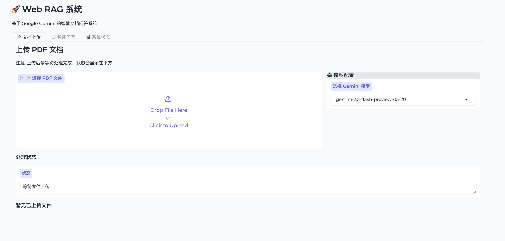
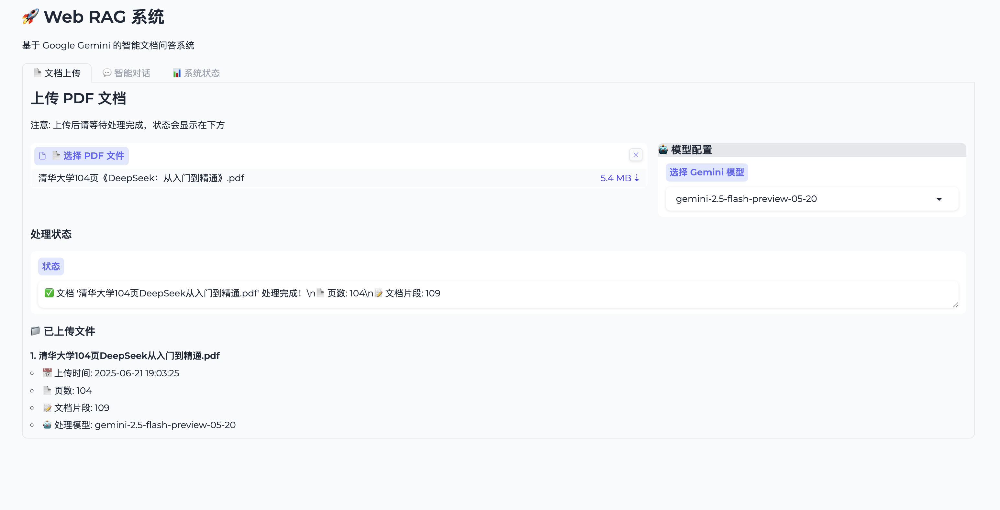
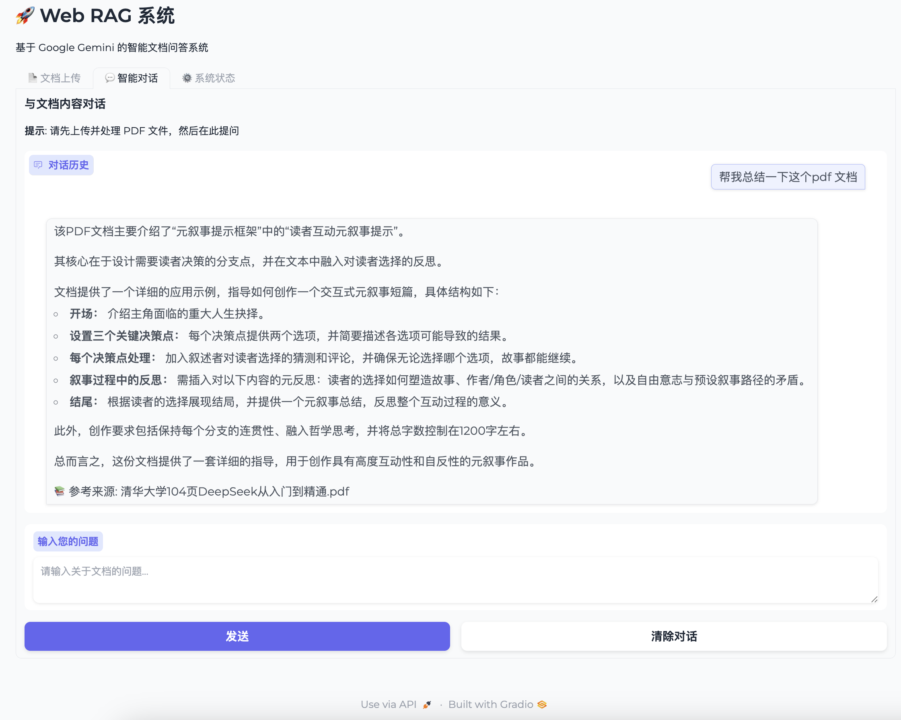
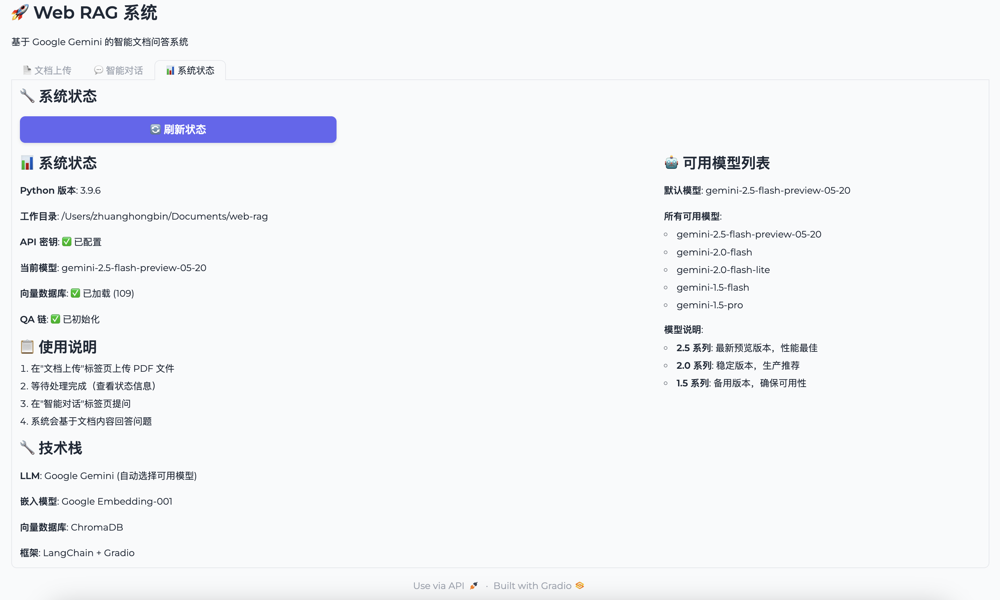

# 📚 Web RAG System

基于 LangChain 和 Gemini API 的现代化 RAG 系统，采用分层架构设计，经过重构，实现了专业的可维护性、可扩展性和可靠性。支持本地文档读取、Web UI 展示，会话持久化，并可部署到 Hugging Face Spaces。

## ✨ 特性

### 🔧 现代化架构

- 🏗️ **分层架构**: 表示层、应用层、共享层、基础设施层
- 🔧 **依赖注入**: 全面支持构造函数依赖注入
- 🎯 **服务抽象**: 接口驱动设计，易于测试和扩展
- 🛡️ **状态管理**: 线程安全的统一状态管理

### 💾 持久化存储

- 📝 **会话持久化**: JSON文件存储会话历史
- 🗑️ **自动清理**: 定期清理过期会话
- 🔧 **数据完整性**: 结构化数据格式和元数据

### 🔄 向后兼容

- ✅ **完全兼容**: 旧代码无需修改即可工作
- 📈 **渐进迁移**: 支持新旧API同时使用
- 🔗 **透明代理**: 旧接口内部使用新服务实现

### 🚀 性能优化

- ⚡ **延迟加载**: 服务按需初始化
- 💾 **内存缓存**: 当前会话保持在内存中
- 📦 **批量保存**: 定期批量持久化
- 📊 **结构化日志**: 高效的日志记录和查询

### 🛡️ 可靠性

- 🔍 **智能文档解析**: 支持多种文档格式(PDF、Word、Excel、PPT、Markdown、文本)上传和自动解析
- 🧠 **语义检索**: 基于向量相似性的智能文档检索
- 💬 **多轮对话**: 支持上下文感知的连续对话
- 🎨 **美观界面**: 基于 Gradio 的用户友好界面
- ☁️ **云端部署**: 支持 Hugging Face Spaces 一键部署
- 🔧 **错误处理**: 全面的异常捕获和恢复
- 🩺 **健康检查**: 服务状态监控
- 🔄 **资源管理**: 自动清理和内存优化
- 👥 **线程安全**: 多用户并发访问支持

## 📸 功能演示

> **说明**: 以下截图展示了系统的完整功能流程。

### 1. 文档上传界面



系统提供直观的文档上传界面，支持多种文档格式（PDF、Word、Excel、PPT、Markdown、文本），支持拖拽上传和点击选择文件。

### 2. 文档处理流程



上传文档后，系统会自动进行：

- ✅ 多格式文档解析（PDF、Word、Excel、PPT等）
- 📄 文本分块处理（智能段落分割）
- 🔍 向量数据库创建
- 🤖 QA链初始化

### 3. 智能问答对话



基于上传的文档内容进行智能问答：

- 💬 支持自然语言提问
- 📚 自动引用文档来源
- 🎯 精准的上下文理解
- 🔄 多轮连续对话

### 4. 系统状态监控



实时显示系统运行状态：

- 🔧 **技术栈**: LangChain + Gradio + ChromaDB
- 🤖 **AI模型**: Google Gemini (自动选择可用模型)
- 💾 **数据库**: ChromaDB 向量存储
- 📊 **系统信息**: Python版本、工作目录、API状态

### 架构特性

- 🏗️ **分层架构**: 表示层 + 应用服务层 + 共享层 + 基础设施层
- 🔧 **依赖注入**: 全面支持构造函数依赖注入和服务生命周期管理
- 🎯 **服务化设计**: DocumentService、ChatService、ModelService、MemoryService
- 💾 **内存管理**: 现代化会话持久化和内存服务集成
- 🛡️ **线程安全**: 延迟服务初始化 + RLock保护
- 📦 **模块化**: 清晰的职责边界，松耦合设计
- 🔄 **向后兼容**: 完全兼容旧API，透明代理机制
- ⚙️ **基础设施完整性**: 配置管理、日志服务、工具服务、外部接口

### 核心改进

- ✅ **业务逻辑分离**: UI层与服务层完全解耦
- ✅ **服务集成**: 新增MemoryService + 向后兼容适配器
- ✅ **基础设施现代化**: 配置服务、日志服务、依赖注入容器
- ✅ **会话持久化**: JSON文件存储 + 自动清理 + 结构化数据
- ✅ **并发安全**: 支持多用户同时访问 + 资源自动管理
- ✅ **现代化架构**: 接口驱动设计 + 工厂模式 + 状态管理

### 重构历程

| 阶段  | 状态    | 重构内容                     | 主要成果       |
| ----- | ------- | ---------------------------- | -------------- |
| 阶段1 | ✅ 完成 | 核心服务抽取与状态管理重构   | 分层架构建立   |
| 阶段2 | ✅ 完成 | UI控制器分离与表示层重构     | 组件化UI架构   |
| 阶段3 | ✅ 完成 | 基础设施层抽象与依赖注入实现 | 现代化基础设施 |
| 阶段4 | ✅ 完成 | 配置和工具模块重组优化       | 统一配置管理   |
| 阶段5 | ✅ 完成 | 内存管理服务集成优化         | 会话持久化     |
| 阶段6 | ✅ 完成 | 目录结构最终整理与文档完善   | -              |
| 阶段7 | ✅ 完成 | 性能优化与扩展性增强         | -              |

📖 **详细架构**: 查看 [docs/architecture/ARCHITECTURE.md](docs/architecture/ARCHITECTURE.md) 了解完整的技术设计和模块接口

## 🚀 快速开始

### 环境要求

- Python 3.8+
- Google Gemini API密钥

### 环境配置

1. **克隆项目**

```bash
git clone git@github.com:Hbin-Zhuang/web-rag.git
cd web-rag
```

2. **创建虚拟环境**

```bash
# 方法1: 使用脚本（推荐）
./activate_env.sh

# 方法2: 手动创建
python3 -m venv .venv
source .venv/bin/activate  # macOS/Linux
# .venv\Scripts\activate  # Windows

# 退出虚拟环境
deactivate
```

3. **安装依赖**

```bash
pip install -r requirements.txt
```

4. **配置API密钥**

```bash
# 复制环境变量示例文件
cp .env.example .env

# 编辑 .env 文件，填入您的 Google API Key
# GOOGLE_API_KEY=your_google_api_key_here
```

**重要提示**：

- 🔐 **安全性**：请勿将真实的 API Key 提交到代码仓库
- 📝 **配置方式**：支持 `.env` 文件或环境变量两种配置方式
- ⚠️ **格式检查**：系统会自动验证 API Key 格式

5. **启动应用**

```bash
python app.py
```

### Google API Key 获取

1. 访问 [Google AI Studio](https://aistudio.google.com/)
2. 登录您的 Google 账户
3. 创建新的 API Key
4. 将 API Key 添加到 `.env` 文件中

## 🎯 使用指南

### 1. 上传文档

- 在"文档上传"标签页选择文档文件（支持PDF、Word、Excel、PPT、Markdown、文本格式）
- 点击"开始处理"按钮
- 等待系统完成文档解析和向量化

### 2. 智能问答

- 切换到"智能问答"标签页
- 在输入框中输入您的问题
- 系统会基于上传的文档内容生成回答

### 3. 系统监控

- "系统状态"标签页显示当前系统运行状态
- 包括API配置、数据库状态、会话信息等

## 🛠️ 配置选项

系统支持通过环境变量进行灵活配置，包括模型参数、处理限制、性能调优等。

📖 **详细配置**: 查看 [docs/architecture/CONFIGURATION.md](docs/architecture/CONFIGURATION.md) 了解完整的配置指南

## 🌐 部署到 Hugging Face Spaces

本项目已完全适配 Hugging Face Spaces 部署环境，支持一键部署和自动构建。

### 🚀 快速部署（推荐）

#### 方法 1: GitHub 集成部署

1. **准备 GitHub 仓库**

   ```bash
   git clone https://github.com/Hbin-Zhuang/web-rag.git
   cd web-rag
   ```
2. **创建 Hugging Face Space**

   - 访问 [Hugging Face Spaces](https://huggingface.co/new-space)
   - Space name: `web-rag-system` (或您喜欢的名称)
   - License: `MIT`
   - SDK: `Gradio`
   - 选择 **"Connect to GitHub repository"**
   - 选择您的 `web-rag` 仓库
3. **配置 API 密钥**

   - 进入 Space 的 **"Settings"** 标签
   - 在 **"Repository secrets"** 部分添加：
     - Name: `GOOGLE_API_KEY`
     - Value: 您的 Google Gemini API Key
4. **等待自动部署**

   - HF Spaces 会自动检测配置并开始构建
   - 构建完成后即可访问您的应用

### 📍 获取访问地址

部署成功后，您的应用地址为：

```
https://huggingface.co/spaces/[您的用户名]/[Space名称]
```

## 📖 技术栈

- **🦜 LangChain**: 文档处理和检索链框架
- **🤖 Google Gemini**: 大语言模型和嵌入模型
- **🔍 ChromaDB**: 向量数据库
- **🎨 Gradio**: Web 界面框架
- **📄 Unstructured**: 多格式文档处理（PDF、Word、Excel、PPT、Markdown、文本）
- **🐍 Python 3.8+**: 编程语言

## 🔧 开发指南

本项目采用模块化架构设计，支持灵活的功能扩展和自定义开发。

## 🐛 故障排除

### 常见问题

1. **API Key 错误**

   - 确认 Google API Key 已正确设置在 `.env` 文件或环境变量中
   - 检查 API Key 格式是否正确（应以 `AIza` 开头）
   - 验证 API Key 是否有效且有足够配额
   - 确保 API Key 来自 [Google AI Studio](https://aistudio.google.com/)
2. **文档处理失败**

   - 确认文件未损坏
   - 检查文件大小是否超过限制
3. **向量化失败**

   - 检查网络连接
   - 确认 API 配额未用完
4. **内存不足**

   - 调整 `CHUNK_SIZE` 参数
   - 减少批处理大小

### 日志查看

应用会在控制台输出详细日志，包括：

- 文档处理进度
- API 调用状态
- 错误信息和堆栈跟踪

## 📄 许可证

MIT License - 详见 [LICENSE](LICENSE) 文件

## 🤝 贡献

欢迎提交 Issue 和 Pull Request！

---
