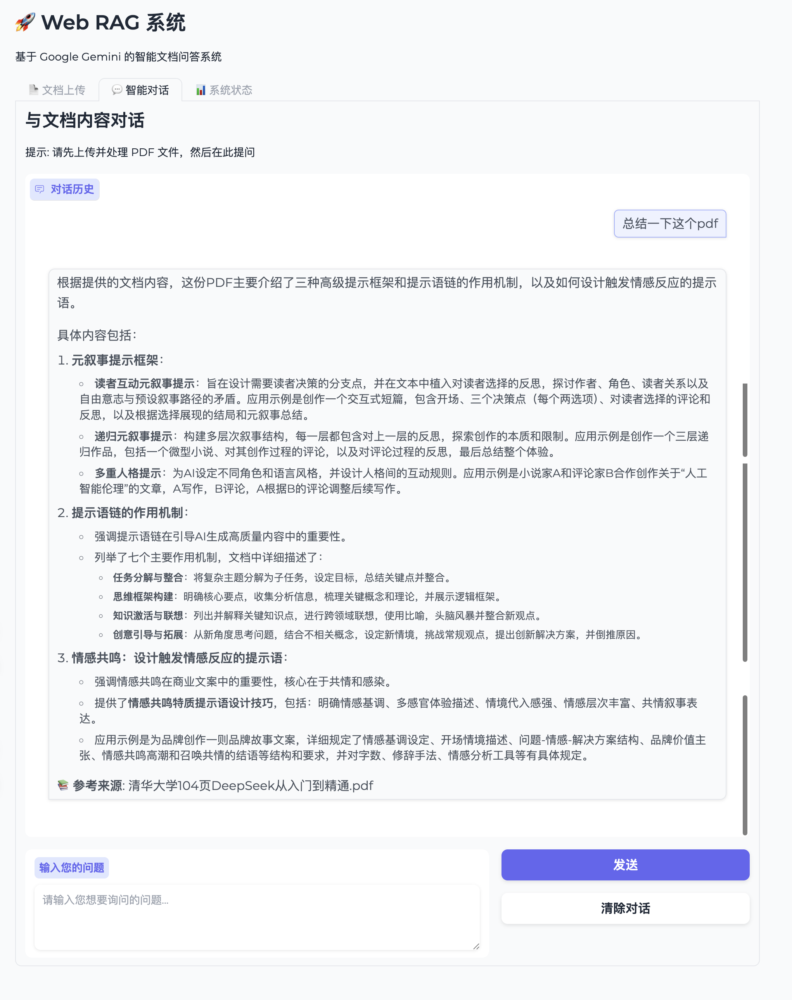

# 📚 Web RAG System

基于 LangChain 和 Gemini 的轻量级 RAG 系统，支持本地 PDF 文档读取、Web UI 展示，并可部署到 Hugging Face Spaces。

## ✨ 特性

- 🔍 **智能文档解析**: 支持 PDF 文档上传和自动解析
- 🧠 **语义检索**: 基于向量相似性的智能文档检索
- 💬 **多轮对话**: 支持上下文感知的连续对话
- 🎨 **美观界面**: 基于 Gradio 的用户友好界面
- ☁️ **云端部署**: 支持 Hugging Face Spaces 一键部署
- 🚀 **快速启动**: 轻量化架构，快速启动和部署

## 📸 功能演示

> **说明**: 以下截图展示了系统的完整功能流程。

### 1. 文档上传界面


系统提供直观的文档上传界面，支持拖拽上传和点击选择文件。

### 2. 文档处理流程


上传PDF后，系统会自动进行：
- ✅ PDF文档解析（104页文档）
- 📄 文本分块处理（109个文档片段）
- 🔍 向量数据库创建
- 🤖 QA链初始化

### 3. 智能问答对话


基于上传的文档内容进行智能问答：
- 💬 支持自然语言提问
- 📚 自动引用文档来源
- 🎯 精准的上下文理解
- 🔄 多轮连续对话

### 4. 系统状态监控


实时显示系统运行状态：
- 🔧 **技术栈**: LangChain + Gradio + ChromaDB
- 🤖 **AI模型**: Google Gemini (自动选择可用模型)
- 💾 **数据库**: ChromaDB 向量存储
- 📊 **系统信息**: Python版本、工作目录、API状态

## 🏗️ 系统架构

**重构升级 (v2.0)**: 采用分层架构设计，替代单体应用架构，大幅提升可维护性和扩展性。

### 架构特性
- 🏗️ **分层架构**: 表示层 + 应用服务层 + 状态管理层
- 🔧 **服务化设计**: DocumentService、ChatService、ModelService
- 🛡️ **线程安全**: 单例状态管理 + RLock保护
- 📦 **模块化**: 清晰的职责边界，松耦合设计

### 核心改进
- ✅ **消除全局变量**: 4个全局变量 → 线程安全的ApplicationState
- ✅ **代码量优化**: 642行单体 → 300行重构版 (减少53%)
- ✅ **业务逻辑分离**: UI层与服务层完全解耦
- ✅ **并发安全**: 支持多用户同时访问

📖 **详细架构**: 查看 [docs/architecture/ARCHITECTURE.md](docs/architecture/ARCHITECTURE.md) 了解完整的技术设计和模块接口

## 🚀 快速开始

### 环境要求
- Python 3.8+
- Google Gemini API密钥

### 环境配置

1. **克隆项目**
```bash
git clone git@github.com:Hbin-Zhuang/web-rag.git
cd web-rag
```

2. **创建虚拟环境**
```bash
# 方法1: 使用脚本（推荐）
./activate_env.sh

# 方法2: 手动创建
python3 -m venv .venv
source .venv/bin/activate  # macOS/Linux
# .venv\Scripts\activate  # Windows
```

3. **安装依赖**
```bash
pip install -r requirements.txt
```

4. **配置API密钥**
```bash
# 复制环境变量示例文件
cp env.example .env

# 编辑 .env 文件，填入您的 Google API Key
# GOOGLE_API_KEY=your_google_api_key_here
```

**重要提示**：
- 🔐 **安全性**：请勿将真实的 API Key 提交到代码仓库
- 📝 **配置方式**：支持 `.env` 文件或环境变量两种配置方式
- ⚠️ **格式检查**：系统会自动验证 API Key 格式

4. **启动应用**
```bash
python app.py
```

### Google API Key 获取

1. 访问 [Google AI Studio](https://aistudio.google.com/)
2. 登录您的 Google 账户
3. 创建新的 API Key
4. 将 API Key 添加到 `.env` 文件中

## 🎯 使用指南

### 1. 上传文档
- 在"文档上传"标签页选择PDF文件
- 点击"开始处理"按钮
- 等待系统完成文档解析和向量化

### 2. 智能问答
- 切换到"智能问答"标签页
- 在输入框中输入您的问题
- 系统会基于上传的文档内容生成回答

### 3. 系统监控
- "系统状态"标签页显示当前系统运行状态
- 包括API配置、数据库状态、会话信息等

## 🛠️ 配置选项

系统支持通过环境变量进行灵活配置，包括模型参数、处理限制、性能调优等。

📖 **详细配置**: 查看 [docs/architecture/CONFIGURATION.md](docs/architecture/CONFIGURATION.md) 了解完整的配置指南

## 🌐 部署到 Hugging Face Spaces

本项目已完全适配 Hugging Face Spaces 部署环境，支持一键部署和自动构建。

### 🚀 快速部署（推荐）

#### 方法 1: GitHub 集成部署

1. **准备 GitHub 仓库**
   ```bash
   git clone https://github.com/your-username/web-rag.git
   cd web-rag
   ```

2. **创建 Hugging Face Space**
   - 访问 [Hugging Face Spaces](https://huggingface.co/new-space)
   - Space name: `web-rag-system` (或您喜欢的名称)
   - License: `MIT`
   - SDK: `Gradio`
   - 选择 **"Connect to GitHub repository"**
   - 选择您的 `web-rag` 仓库

3. **配置 API 密钥**
   - 进入 Space 的 **"Settings"** 标签
   - 在 **"Repository secrets"** 部分添加：
     - Name: `GOOGLE_API_KEY`
     - Value: 您的 Google Gemini API Key

4. **等待自动部署**
   - HF Spaces 会自动检测配置并开始构建
   - 构建完成后即可访问您的应用

#### 方法 2: 直接上传部署

1. **创建新 Space**
   - 访问 [Hugging Face Spaces](https://huggingface.co/new-space)
   - 填写基本信息，选择 Gradio SDK

2. **上传核心文件**
   ```
   app.py              # 主应用文件 (重构版)
   requirements.txt    # 依赖清单
   runtime.txt         # Python 版本
   src/                # 重构后的源代码目录
   ├── application/    # 应用服务层
   │   └── services/   # 核心业务服务
   └── shared/         # 共享模块
       └── state/      # 状态管理
   config.py          # 配置模块
   memory.py          # 记忆管理
   utils.py           # 工具函数
   indexer.py         # 索引器
   pdf_loader.py      # PDF 加载器
   retriever.py       # 检索器
   ```

3. **配置环境变量**
   - 在 Settings 中添加 `GOOGLE_API_KEY`

### 📍 获取访问地址

部署成功后，您的应用地址为：
```
https://huggingface.co/spaces/[您的用户名]/[Space名称]
```

### 🔧 部署后优化

- **性能调优**: 根据使用量选择合适的硬件配置
- **访问控制**: 设置 Public/Private 可见性
- **监控分析**: 查看使用统计和性能指标

📖 **详细部署指南**: 查看 [HF_SPACES_DEPLOYMENT.md](HF_SPACES_DEPLOYMENT.md) 获取完整的部署文档和故障排除指南。

## 📖 技术栈

- **🦜 LangChain**: 文档处理和检索链框架
- **🤖 Google Gemini**: 大语言模型和嵌入模型
- **🔍 ChromaDB**: 向量数据库
- **🎨 Gradio**: Web 界面框架
- **📄 PyPDF**: PDF 文档处理
- **🐍 Python 3.8+**: 编程语言

## 🔧 开发指南

本项目采用模块化架构设计，支持灵活的功能扩展和自定义开发。

## 📖 文档导航

| 文档 | 用途 | 受众 |
|------|------|------|
| [README.md](README.md) | 项目概述、快速开始、部署指南 | 所有用户 |
| [docs/ARCHITECTURE.md](docs/ARCHITECTURE.md) | 技术架构、API接口、扩展指南 | 开发者 |
| [docs/CONFIGURATION.md](docs/CONFIGURATION.md) | 详细配置、性能调优、环境变量 | 运维人员、高级用户 |
| [docs/DEVELOPMENT_LOG.md](docs/DEVELOPMENT_LOG.md) | 开发进度、任务跟踪、变更记录 | 项目维护者 |

## 🐛 故障排除

### 常见问题

1. **API Key 错误**
   - 确认 Google API Key 已正确设置在 `.env` 文件或环境变量中
   - 检查 API Key 格式是否正确（应以 `AIza` 开头）
   - 验证 API Key 是否有效且有足够配额
   - 确保 API Key 来自 [Google AI Studio](https://aistudio.google.com/)

2. **文档处理失败**
   - 确认 PDF 文件未损坏
   - 检查文件大小是否超过限制

3. **向量化失败**
   - 检查网络连接
   - 确认 API 配额未用完

4. **内存不足**
   - 调整 `CHUNK_SIZE` 参数
   - 减少批处理大小

### 日志查看

应用会在控制台输出详细日志，包括：
- 文档处理进度
- API 调用状态
- 错误信息和堆栈跟踪

## 📄 许可证

MIT License - 详见 [LICENSE](LICENSE) 文件

## 🤝 贡献

欢迎提交 Issue 和 Pull Request！

---

**⭐ 如果这个项目对您有帮助，请给个星标支持！**
